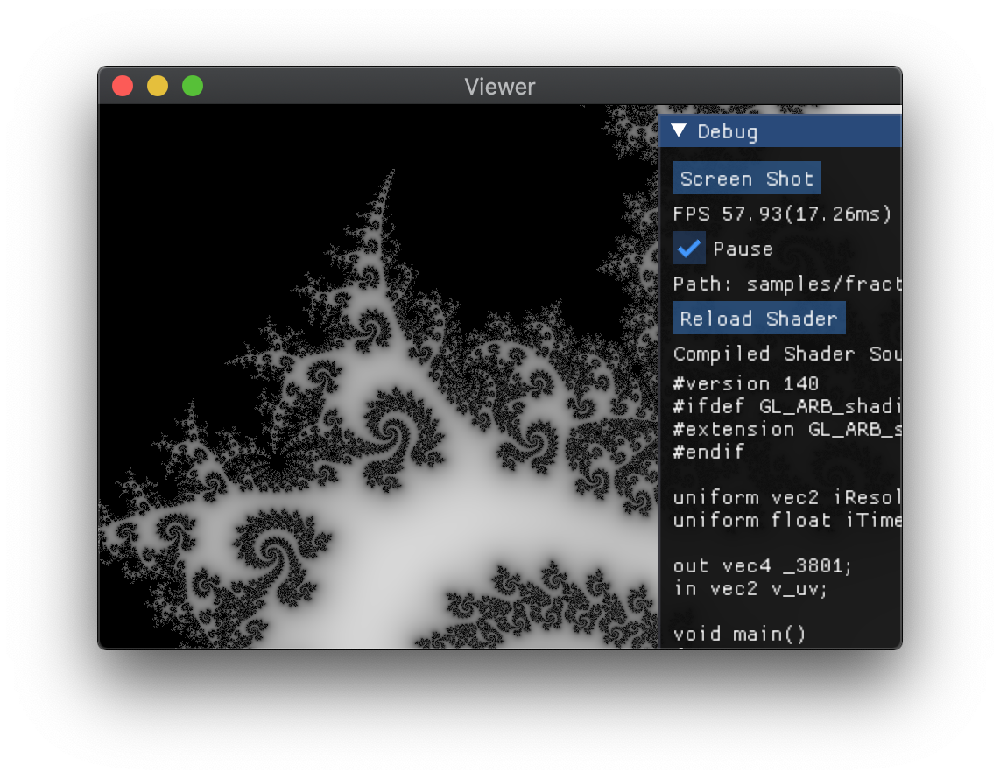

# YASL

Yet Another Shading Language.

A strong typed functional(not really) IR that compiles to GLSL.

See [doc](compiler/doc/definitions.md) for syntax definition.

## Requirement

+ OCaml 4.11
+ C++ 17
+ Python 3

## Download

```
git clone https://github.com/huisedenanhai/YASL.git
```

## Build

To build the YASL to GLSL compiler

```
cd compiler
dune build
```

To build the viewer

First update dependencies

```
cd viewer/third_party/shaderc/utils
python3 git-sync-deps
```

Then build the viewer project with default cmake options

## Usage

Compile YASL to GLSL

```
yasl [-ast] filename [-o output]
  -ast dump ast
  -o set output file name
  -help  Display this list of options
  --help  Display this list of options
```

Default output name is `filename.gen.frag`

Then feed the compiled fragment shader to the viewer

```
viewer filename.gen.frag
```

Sample YASL prorgams are in `compiler/samples`.

If one does correctly for the sample `fractal.ysl`, a fractal shape will be shown in the viewer.



## Viewer

The viewer provides following uniforms

```
uniform iTime: float  /* Time from start */
uniform iResolution: vec2   /* Screen resolution */
```
